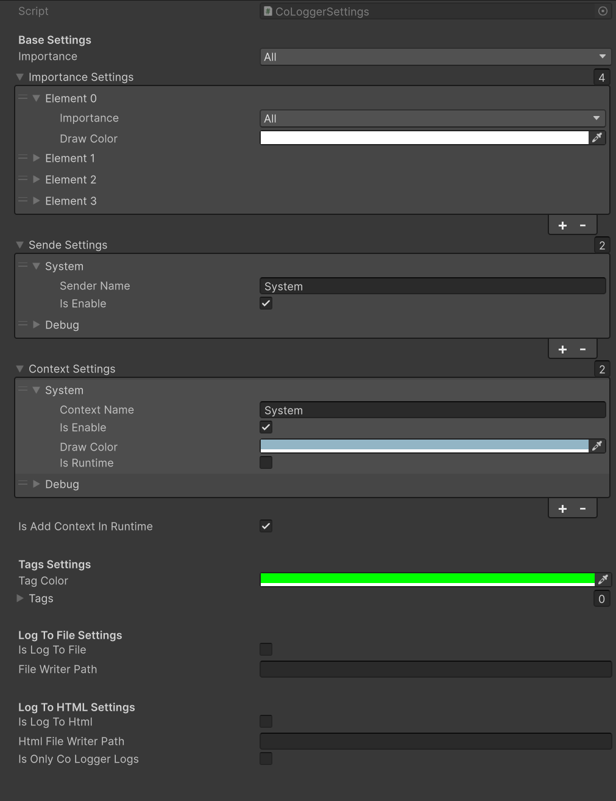
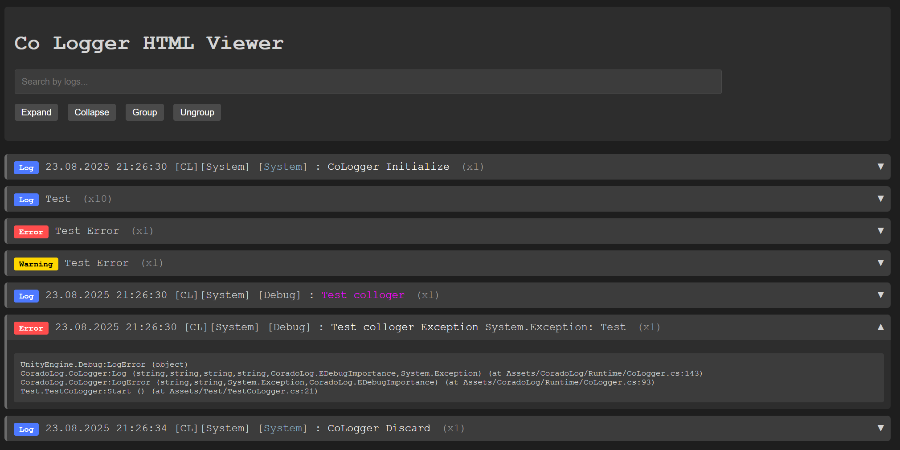

# CoradoLog Documentation

CoradoLog is a Unity logging package for structured runtime logs. It can write logs to the Unity Console, text files, HTML files, and a remote CoradoWeb-compatible HTTP service.

The package runtime code lives in `CoradoLog/Runtime`. Editor helpers and code generators live in `CoradoLog/Editor`.



## Main Concepts

CoradoLog adds structure around a log message:

- `sender` - who produced the log, for example `System`, `UI`, `Network`, `Battle`.
- `context` - where or in what subsystem the log happened.
- `tag` - optional extra label. Tags must exist in settings if a tag is used.
- `importance` - minimum level filter: `All`, `Medium`, `Important`, `Critical`.
- `customData` - optional object attached to a log.
- `callStack` - call stack captured by `CoLogger` and sent to web/file sinks.

Runtime log events are represented by `CoLoggerEntry`.

## Quick Start

1. Create settings asset:
   `Assets/Create/CoLogger/CoLoggerSettings`.
2. Add a `CoLoggerInitiator` to your first scene.
3. Assign the `CoLoggerSettings` asset to the initiator.
4. Configure senders, contexts, importance colors, file/html/web options.
5. Log from code:

```csharp
using CoradoLog;

public class Example
{
    public void Run()
    {
        CoLogger.Log("Game started");
        CoLogger.LogWarning("Low health", "Gameplay");
        CoLogger.LogError("Failed to load save", new Exception("Save file is missing"));
    }
}
```

`CoLoggerInitiator` calls `CoLogger.Init(settings)` in `Awake`, applies the default sender if it is assigned, then destroys its own GameObject. `CoLogger` creates an internal lifecycle object marked with `DontDestroyOnLoad`.

## Initialization And Lifecycle

Manual initialization is also supported:

```csharp
CoLogger.Init(settings);
```

Lifecycle behavior:

- Calling `CoLogger.Log` before `Init` writes a fallback Unity log and prints one warning about missing initialization.
- Repeated `Init` is ignored and writes a Unity warning. Call `CoLogger.Discard()` before initializing again.
- `CoLogger.Discard()` closes writers, discards the web module, clears subscriptions, runtime contexts, events and runtime state.
- If `CORADOLOG_DISABLED` is defined, `CoLogger` becomes a no-op and does not initialize runtime state.
- On application quit, the lifecycle object asks the web module to flush if `FlushOnApplicationQuit` is enabled.

## Disable CoradoLog

For builds where logging must be fully disabled, add this scripting define symbol:

```text
CORADOLOG_DISABLED
```

Unity path:

```text
Project Settings > Player > Other Settings > Scripting Define Symbols
```

When `CORADOLOG_DISABLED` is enabled:

- `CoLogger.IsDisabled` returns `true`.
- `CoLogger.IsInitialized` returns `false`.
- `CoLogger.Init(...)` returns immediately.
- `CoLogger.Log`, `LogWarning`, `LogError` return immediately.
- `CoLogger.AddContext`, `SetTransmitter`, `SetDefaultParams`, `SetCustomDataProvider` do nothing.
- File writer, HTML writer, web module and lifecycle object are not created.
- `LogReceived` is not raised.
- Existing calls still compile, so game code does not need `#if` guards around every log call.

Example:

```csharp
if (CoLogger.IsDisabled)
{
    // CoradoLog is compiled as no-op.
}
```

## Settings

`CoLoggerSettings` controls the base logger behavior.

### Base Settings

- `Importance` - minimum importance that is allowed to appear in Unity Console and `LogReceived`.
- `ImportanceSettings` - color per importance.
- `SendeSettings` - enabled senders. A sender must be present and enabled.
- `ContextSettings` - enabled contexts and their colors.
- `IsAddContextInRuntime` - if true, unknown contexts are added during runtime and marked with `!` in output.

### Tags Settings

- `TagColor` - color used for tag rendering.
- `Tags` - allowed tag names. If a log uses a non-empty tag that does not exist in this list, the log is skipped.

### File Settings

- `IsLogToFile` - enables text file writer.
- `FileWriterPath` - path relative to `Application.dataPath`.
- `SkipConditionsForFileWriter` - if true, file writer receives logs even when sender/context/importance filters skip console output.

### HTML Settings

- `IsLogToHtml` - enables HTML file writer.
- `HtmlFileWriterPath` - path relative to `Application.dataPath`.
- `IsOnlyCoLoggerLogs` - controls whether HTML writer should only write CoradoLog logs.



### Web Settings

- `IsLogToWeb` - enables web transport.
- `WebSettings` - reference to `CoLoggerWebSettings`.

## Logging API

Basic logs:

```csharp
CoLogger.Log("Message");
CoLogger.LogWarning("Warning message");
CoLogger.LogError("Error message", new Exception("Details"));
```

With context:

```csharp
CoLogger.Log("Message", "Gameplay");
CoLogger.LogWarning("Warning message", "Gameplay", EDebugImportance.Medium);
CoLogger.LogError("Error message", "Gameplay", new Exception("Details"));
```

With sender, context and tag:

```csharp
CoLogger.Log(
    "Message",
    "BattleSystem",
    "Gameplay",
    "Spawn",
    EDebugImportance.Important);

CoLogger.LogWarning(
    "Warning message",
    "BattleSystem",
    "Gameplay",
    "Balance",
    EDebugImportance.Medium);

CoLogger.LogError(
    "Error message",
    "BattleSystem",
    "Gameplay",
    "Save",
    EDebugImportance.Critical,
    new Exception("Save failed"));
```

With custom data:

```csharp
CoLogger.Log("Player state", "Gameplay", EDebugImportance.All, customData: playerState);
```

For Unity Console formatting, register a custom formatter:

```csharp
using CoradoLog.Interfaces;

public sealed class JsonCustomDataProvider : ICoLoggerCustomDataProvider
{
    public string GetCustomDataFormat(object customData)
    {
        return JsonUtility.ToJson(customData);
    }
}

CoLogger.SetCustomDataProvider(new JsonCustomDataProvider());
```

For web transport, custom data is currently sent as `customData.ToString()`.

## CoLog Instance Wrapper

`CoLog` stores sender, context and importance once and reuses them:

```csharp
private readonly CoLog _log = new CoLog("Inventory", "Gameplay", EDebugImportance.Medium);

public void AddItem(string itemId)
{
    _log.Log($"Add item {itemId}");
    _log.LogWarning("Inventory is almost full");
    _log.LogError("Item config is missing", ex: new Exception(itemId));
}
```

The constructor calls `CoLogger.AddContext(context)`, so runtime contexts can be added automatically if settings allow it.

## Generated Access Classes

`CoLoggerInitiator` inspector has generation buttons.

`Generate Vars` creates `CoLoggerVars.cs` inside:

```text
Assets/{GeneratePath}/CoradoLogGenerated/CoLoggerVars.cs
```

Example usage:

```csharp
CoLogger.Log(
    "Message",
    CoLoggerVars.Senders.System,
    CoLoggerVars.Contexts.System,
    string.Empty);
```

`Generate Sender` creates a static sender-specific helper class. The generated class name is based on the selected sender, for example `DebugSystem`, and uses the default context `Debug`.

Generated files are placed in `CoradoLogGenerated` under the initiator `GeneratePath`.

## LogReceived Event

`CoLogger.LogReceived` is raised for valid CoLogger logs after sender/context/importance/tag filters pass.

```csharp
CoLogger.LogReceived += entry =>
{
    Debug.Log($"[{entry.Level}] {entry.Sender}/{entry.Context}: {entry.Message}");
};
```

`CoLogger.Discard()` clears this event subscription list.

## Web Logging

Create web settings asset:

```text
Assets/Create/CoLogger/Web Settings
```

Assign it to `CoLoggerSettings.WebSettings` and enable `IsLogToWeb`.

`CoLoggerWebSettings` fields:

- `BaseUrl` - service URL
- `ApiToken` - project/environment token received from the web service.
- `SendCoLoggerLogs` - send logs produced by `CoLogger`.
- `SendUnityLogs` - capture Unity logs through `Application.logMessageReceived`.
- `SendUnityInfoLogs` - also send regular `Debug.Log` / `LogType.Log` messages.
- `SendUnityWarningLogs` - send Unity `LogType.Warning` messages.
- `Source` - client source name, default `Unity`.
- `AppVersion` - optional app version. If empty, `Application.version` is used.
- `BuildNumber` - optional build number.
- `ExternalUserId` - optional user/player identifier.
- `UseDeviceUniqueIdentifier` - send `SystemInfo.deviceUniqueIdentifier` as device id.
- `SessionPrefixFilePath` - file path inside `StreamingAssets` used to override the session id prefix. Default: `corado-session-prefix.txt`.
- `BatchSize` - max logs per request. The module clamps it to backend max batch size.
- `FlushIntervalSeconds` - periodic flush interval.
- `MaxQueueSize` - max local queue size. Old logs are dropped when the queue is full.
- `FlushOnApplicationQuit` - flush on application quit.

Session ids are generated as:

```text
{prefix}{guid}
```

By default, prefix is `unity-`, for example `unity-0f8fad5b9cb469fbd2c9037f6a8d9e1`. If `StreamingAssets/{SessionPrefixFilePath}` exists, CoradoLog reads the file, trims the content, and uses it as the prefix. If the file is missing, empty, or cannot be read, it falls back to `unity-`.

For example, if `Assets/StreamingAssets/corado-session-prefix.txt` contains:

```text
android-
```

the session id will look like:

```text
android-0f8fad5b9cb469fbd2c9037f6a8d9e1
```

Editor/build scripts can write this file before a build with `CoLoggerSessionPrefixFileWriter`:

```csharp
using CoradoLog.Editor;

CoLoggerSessionPrefixFileWriter.WriteDefaultSessionPrefixFile("steam-");
CoLoggerSessionPrefixFileWriter.WriteSessionPrefixFile(webSettings, "android-");
CoLoggerSessionPrefixFileWriter.WriteSessionPrefixFile("custom/path/session-prefix.txt", "ios-");
```

Available editor helper methods:

- `WriteDefaultSessionPrefixFile(string prefix)` - writes `Assets/StreamingAssets/corado-session-prefix.txt`.
- `WriteSessionPrefixFile(CoLoggerWebSettings settings, string prefix)` - uses `settings.SessionPrefixFilePath`.
- `WriteSessionPrefixFile(string relativePath, string prefix)` - writes a custom path inside `Assets/StreamingAssets`.
- `GetSessionPrefixAssetPath(...)` - returns the target `Assets/StreamingAssets/...` asset path.

The module sends batches to:

```text
{BaseUrl}/api/v1/logs/batch
```

with header:

```text
X-Corado-Token: {ApiToken}
```

## Duplicate Protection

Web transport has duplicate protection for stuck logs, for example the same warning printed every `Update`.

Settings:

- `IsDuplicateProtectionEnabled` - enables duplicate filtering.
- `MaxSameLogsPerWindow` - how many identical logs are allowed during the time window.
- `DuplicateWindowSeconds` - duplicate window duration.
- `SendDuplicateSummary` - sends one summary log after suppressing duplicates.

Default behavior: first 3 identical logs are sent during 5 seconds, the rest are suppressed. After the window expires, the module can send a summary like:

```text
Suppressed 42 duplicate logs during 5 seconds: Some repeated message
```

Duplicate key includes level, sender, context, tag, message, exception type/message and call stack.

## Using Web Module Without CoLogger

Projects with their own logger can use only `CoLoggerWebModule`.

```csharp
using CoradoLog;
using CoradoLog.Web;
using UnityEngine;

public sealed class MyWebLogBridge : MonoBehaviour
{
    [SerializeField] private CoLoggerWebSettings _settings;
    private CoLoggerWebModule _webModule;

    private void Awake()
    {
        _webModule = new CoLoggerWebModule();
        _webModule.Init(_settings, this);
    }

    public void Send(string message)
    {
        _webModule.QueueLog(
            message,
            CoLoggerEntryLevel.Information,
            sender: "MyLogger",
            context: "Runtime");
    }

    private void OnDestroy()
    {
        _webModule?.Discard();
    }
}
```

Convenience methods:

```csharp
_webModule.QueueWarning("Warning message", sender: "MyLogger", context: "Runtime");
_webModule.QueueError("Error message", sender: "MyLogger", context: "Runtime", exception: ex);
_webModule.QueueCritical("Critical message", sender: "MyLogger", context: "Runtime", exception: ex);
```

## Unity Log Capture

When `SendUnityLogs` is enabled, the web module subscribes to `Application.logMessageReceived`.

Captured Unity types:

- `LogType.Log` -> `Information` when `SendUnityInfoLogs` is enabled
- `LogType.Warning` -> `Warning` when `SendUnityWarningLogs` is enabled
- `LogType.Assert` -> `Error`
- `LogType.Error` -> `Error`
- `LogType.Exception` -> `Critical`

Regular Unity `LogType.Log` messages are sent when `SendUnityInfoLogs` is enabled. Unity warnings are sent when `SendUnityWarningLogs` is enabled. CoradoLog-formatted Unity messages containing `[CL]` are still ignored to avoid duplicate web sends when `SendCoLoggerLogs` is enabled.

Unity does not expose the `UnityEngine.Object context` argument from `Debug.Log(message, context)` through `Application.logMessageReceived`, so CoradoLog can send the formatted message and stack trace, but not the original context object reference.

## Troubleshooting

### Logs do not appear

Check:

- `CORADOLOG_DISABLED` is not added to Scripting Define Symbols unless you intentionally disabled CoradoLog.
- `CoLogger.Init(settings)` was called or `CoLoggerInitiator` exists in the first scene.
- Sender exists in `SendeSettings` and is enabled.
- Context exists in `ContextSettings` and is enabled, or `IsAddContextInRuntime` is enabled.
- Log importance is greater than or equal to `CoLoggerSettings.Importance`.
- Tag is empty or exists in `Tags`.

### Web logs do not appear

Check:

- `CORADOLOG_DISABLED` is not added to Scripting Define Symbols unless you intentionally disabled CoradoLog.
- `CoLoggerSettings.IsLogToWeb` is enabled.
- `CoLoggerSettings.WebSettings` is assigned.
- `CoLoggerWebSettings.BaseUrl` and `ApiToken` are not empty.
- `SendCoLoggerLogs` or `SendUnityLogs` is enabled depending on the source.
- `SendUnityWarningLogs` is enabled if you expect Unity warnings in web logs.
- Server accepts requests on `/api/v1/logs/batch` with `X-Corado-Token`.

### Same log is sent too often

Enable duplicate protection and tune:

```text
MaxSameLogsPerWindow = 3
DuplicateWindowSeconds = 5
SendDuplicateSummary = true
```

### Stack trace is missing

For CoLogger logs, stack trace is captured by `CoLogger` when the entry is created. For Unity logs, stack trace comes from `Application.logMessageReceived`. Player build settings and scripting backend can affect how much file/line information Unity provides.


