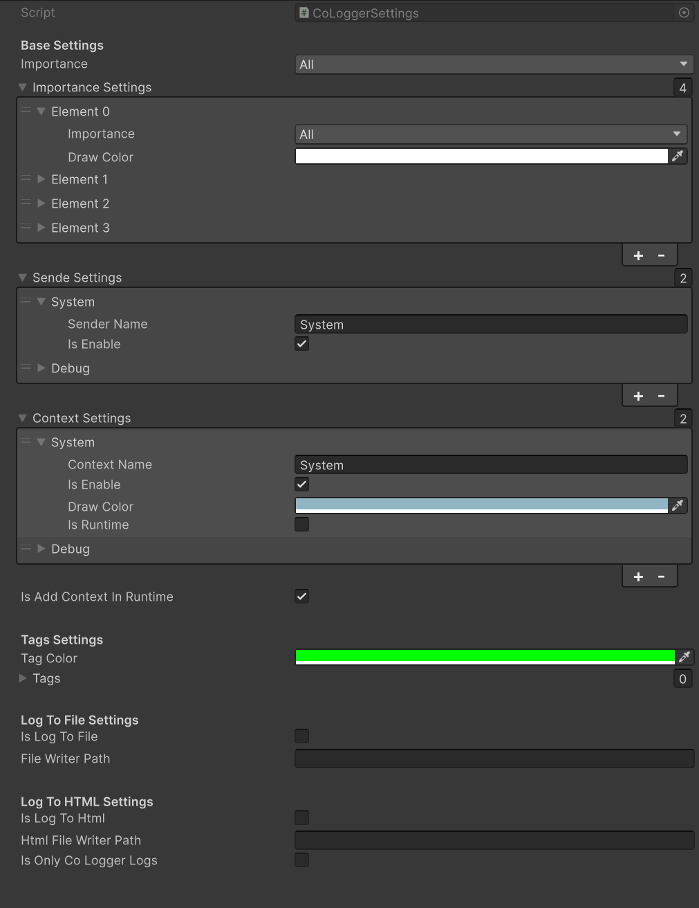
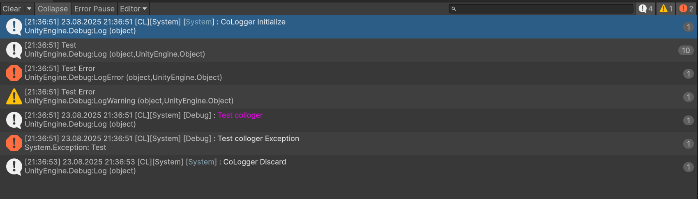
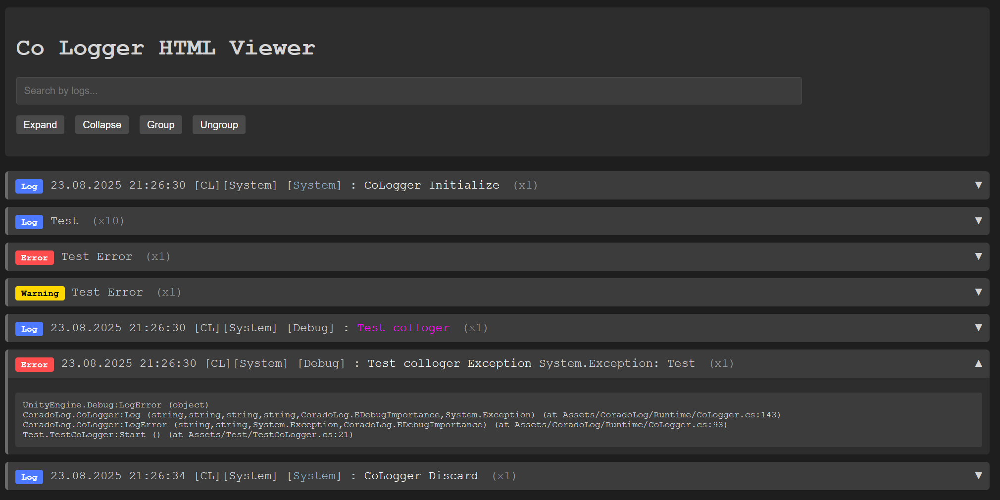

# CoradoLog

### Unity Logs Extension.

**CoLoggerInitializer** - setting prefab

Can add senders, context, and importan.
Can enable disable log, from senders and contexts.

Can generate vars for fast access to senders and contexts.
Can generate personale sender debug class.



```csharp
CoLogger.Log("Test log");
CoLogger.LogError("Test log ex", new System.Exception("Test"));
```

If you have user Test and generate vars and sender class:
Access after generate:

```csharp
CoLogger.Log("Test log", CoLoggerVars.Senders.System, CoLoggerVars.Contexts.System);
CoLogger.LogError("Test log ex", CoLoggerVars.Contexts.System, new System.Exception("Test"));
```

All generated object put to CoradoLogGenerated folder.

Can create log for some context and senders:

```csharp
CoLog log = new CoLog("Test", "TestContext");
log.Log("Test Message");
```
or send directly:

```csharp
Log("Test Message", "TestUser", "TestContext");
```



Can save logs to a file or HTML for more convenient data handling.


