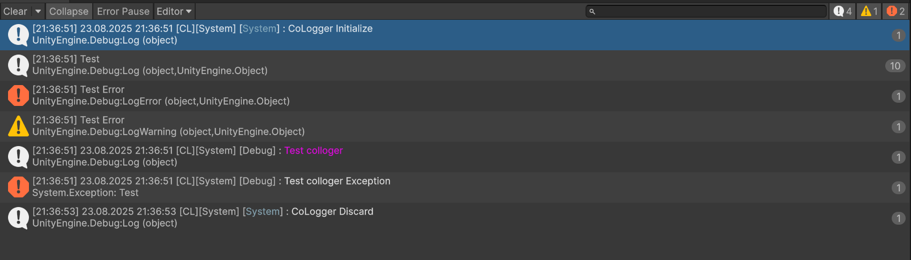

# CoradoLog

CoradoLog is a Unity logging package for structured runtime logs. It adds senders, contexts, tags, importance filters, file/HTML output, Unity log capture, and optional web delivery to a CoradoWeb-compatible backend.

Package name: `com.puzikgames.coradolog`  
Unity version: `2019.1+`


## Features

- Structured logs with `sender`, `context`, `tag`, `importance`, `exception`, `customData`, and call stack.
- Unity Console output with colored context, tag and importance formatting.
- Runtime context support.
- Text file writer.
- HTML file writer.
- Web log delivery through `UnityWebRequest`.
- Unity log/warning/error/exception capture for web delivery.
- Duplicate protection for repeated logs from `Update` loops.
- Generated `CoLoggerVars` and sender-specific helper classes.
- Optional standalone `CoLoggerWebModule` for projects that already have their own logger.
- Compile-time disable switch through `CORADOLOG_DISABLED`.

## Installation

Install as a Unity package from Git URL:

```text
https://github.com/denkacn/CoradoLog.git
```

Or add it to `Packages/manifest.json`:

```json
{
  "dependencies": {
    "com.puzikgames.coradolog": "https://github.com/denkacn/CoradoLog.git"
  }
}
```

## Quick Start

1. Create a settings asset from `Assets/Create/CoLogger/CoLoggerSettings`.
2. Add `CoLoggerInitiator` to the first scene.
3. Assign the settings asset to the initiator.
4. Configure senders, contexts and output options.
5. Log from code.

```csharp
using System;
using CoradoLog;

public class Example
{
    public void Run()
    {
        CoLogger.Log("Game started");
        CoLogger.LogWarning("Low health", "Gameplay");
        CoLogger.LogError("Save failed", new Exception("File is missing"));
    }
}
```

With explicit sender, context and tag:

```csharp
CoLogger.Log(
    "Enemy spawned",
    "BattleSystem",
    "Gameplay",
    "Spawn",
    EDebugImportance.Medium);
```

## CoLog Wrapper

Use `CoLog` when one class repeatedly logs with the same sender and context.

```csharp
using CoradoLog;

public class InventoryService
{
    private readonly CoLog _log = new CoLog("Inventory", "Gameplay", EDebugImportance.Medium);

    public void AddItem(string itemId)
    {
        _log.Log($"Add item {itemId}");
        _log.LogWarning("Inventory is almost full");
    }
}
```

## Generated Accessors

The `CoLoggerInitiator` inspector can generate constants for senders and contexts:

```csharp
CoLogger.Log(
    "System ready",
    CoLoggerVars.Senders.System,
    CoLoggerVars.Contexts.System,
    string.Empty);
```

Generated files are placed in:

```text
Assets/{GeneratePath}/CoradoLogGenerated
```

## File And HTML Output

CoradoLog can save logs to text files or HTML files from `CoLoggerSettings`.



HTML output is useful when logs need to be shared or inspected outside Unity.


## Web Logging

CoradoLog can send logs to a web service using `CoLoggerWebSettings`.

Typical flow:

1. Enable `IsLogToWeb` in `CoLoggerSettings`.
2. Create `CoLoggerWebSettings` from `Assets/Create/CoLogger/Web Settings`.
3. Set `BaseUrl`.
4. Set the project/environment `ApiToken`.
5. Choose sources: `SendCoLoggerLogs`, `SendUnityLogs`, and optionally `SendUnityInfoLogs` / `SendUnityWarningLogs`.
6. Keep `DisableForEditor` enabled if editor logs should not be sent to web.
7. Optional: set `SessionPrefixFilePath` to read the session id prefix from `StreamingAssets`.

The web module sends batches to:

```text
{BaseUrl}/api/v1/logs/batch
```

with header:

```text
X-Corado-Token: {ApiToken}
```

Session ids are generated as `{prefix}{guid}`. By default the prefix is `unity-`. If `StreamingAssets/{SessionPrefixFilePath}` exists, the first trimmed text content is used as the prefix instead. Default file path: `corado-session-prefix.txt`.

Editor/build scripts can write this file before a build:

```csharp
using CoradoLog.Editor;

CoLoggerSessionPrefixFileWriter.WriteDefaultSessionPrefixFile("steam-");
CoLoggerSessionPrefixFileWriter.WriteSessionPrefixFile(webSettings, "android-");
CoLoggerSessionPrefixFileWriter.WriteSessionPrefixFile("custom/path/session-prefix.txt", "ios-");
```

`DisableForEditor` is enabled by default. When enabled, the web module does not initialize in the Unity Editor and no editor logs are sent to web.

`SendUnityLogs` is the master switch for Unity log capture. `SendUnityWarningLogs` controls Unity warnings separately. Errors, asserts and exceptions are sent when `SendUnityLogs` is enabled. If `SendUnityInfoLogs` is enabled, regular `Debug.Log` / `LogType.Log` messages are sent too. Unity does not expose the `Debug.Log(message, context)` object reference through `Application.logMessageReceived`, so CoradoLog sends the formatted message and stack trace, but not the original context object.

## Duplicate Protection

Web delivery includes protection against repeated identical logs, for example logs printed every frame in `Update`.

Default behavior:

- send first `3` identical logs;
- suppress further duplicates during `5` seconds;
- optionally send one summary log with the suppressed count.

This can be configured in `CoLoggerWebSettings`:

```text
IsDuplicateProtectionEnabled
MaxSameLogsPerWindow
DuplicateWindowSeconds
SendDuplicateSummary
```

## Disable CoradoLog

To disable the logger completely, add this scripting define symbol in Unity:

```text
CORADOLOG_DISABLED
```

Unity path:

```text
Project Settings > Player > Other Settings > Scripting Define Symbols
```

When this define is enabled:

- `CoLogger.Init(...)` does nothing;
- `CoLogger.Log`, `LogWarning`, `LogError` do nothing;
- file, HTML and web writers are not created;
- `LogReceived` is not raised;
- existing calls still compile.

You can check the state in code:

```csharp
if (CoLogger.IsDisabled)
{
    // CoradoLog is compiled as no-op.
}
```

## Standalone Web Module

If a project already has its own logger, it can use only `CoLoggerWebModule`.

```csharp
using CoradoLog;
using CoradoLog.Web;
using UnityEngine;

public sealed class MyWebLogBridge : MonoBehaviour
{
    [SerializeField] private CoLoggerWebSettings _settings;
    private CoLoggerWebModule _webModule;

    private void Awake()
    {
        _webModule = new CoLoggerWebModule();
        _webModule.Init(_settings, this);
    }

    public void Send(string message)
    {
        _webModule.QueueLog(
            message,
            CoLoggerEntryLevel.Information,
            sender: "MyLogger",
            context: "Runtime");
    }

    private void OnDestroy()
    {
        _webModule?.Discard();
    }
}
```

## Documentation

Full documentation is available here:

[CoradoLog Documentation](Doc/README.md)

## License

License is not specified in this package yet.


